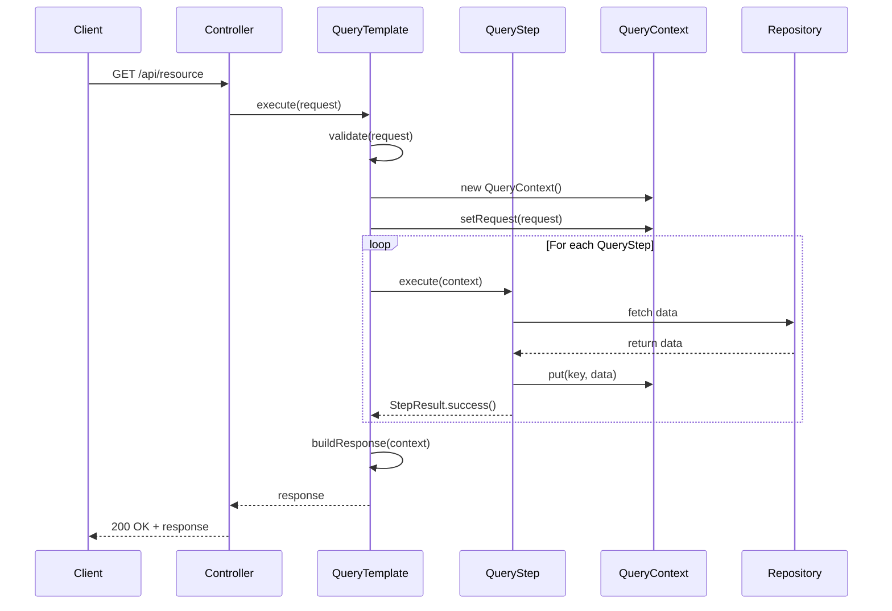
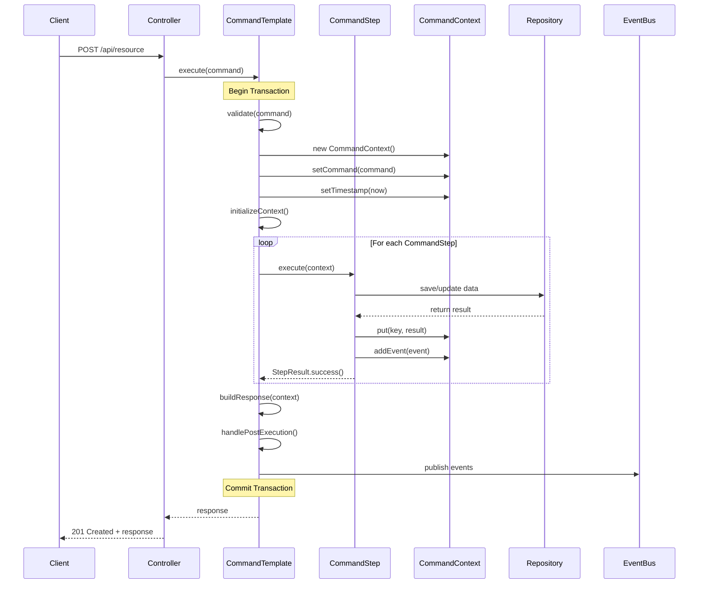

# 🏗️ FlowStep Architecture Documentation

## Overview

FlowStep is a Spring Boot starter that implements the **Template Method** and **CQRS** patterns to provide a consistent, maintainable architecture for Spring Boot applications. It enforces clean separation between read and write operations while providing a step-based execution model for complex business logic.

## Core Design Principles

### 1. **CQRS (Command Query Responsibility Segregation)**
- **Queries**: Read-only operations that don't modify state
- **Commands**: Write operations that modify state and may trigger events
- Clear separation improves scalability, caching, and reasoning about code

### 2. **Template Method Pattern**
- Defines skeleton of algorithm in base class
- Subclasses override specific steps without changing structure
- Ensures consistent execution flow across all services

### 3. **Step-Based Execution**
- Complex operations broken into discrete, testable steps
- Each step has single responsibility
- Steps communicate through shared context

### 4. **Context-Driven Communication**
- Steps share data through context objects
- Eliminates tight coupling between steps
- Enables dynamic step composition

## Architecture Layers

```
┌─────────────────────────────────────────────────────────────┐
│                     Presentation Layer                       │
│                  (Controllers, REST APIs)                    │
└─────────────────────┬───────────────────────────────────────┘
                      │
┌─────────────────────▼───────────────────────────────────────┐
│                    Application Layer                         │
│         (QueryTemplate & CommandTemplate Services)           │
│  ┌──────────────────────┐  ┌──────────────────────┐        │
│  │   Query Services     │  │   Command Services   │        │
│  │  - Read Operations   │  │  - Write Operations  │        │
│  │  - No Transactions   │  │  - Transactional     │        │
│  │  - Cacheable         │  │  - Event Publishing  │        │
│  └──────────────────────┘  └──────────────────────┘        │
└─────────────────────┬───────────────────────────────────────┘
                      │
┌─────────────────────▼───────────────────────────────────────┐
│                      Step Layer                              │
│              (Business Logic Components)                     │
│  ┌─────────────┐  ┌─────────────┐  ┌─────────────┐        │
│  │  Validation  │  │   Fetch     │  │  Transform  │        │
│  │    Steps     │  │   Steps     │  │    Steps    │        │
│  └─────────────┘  └─────────────┘  └─────────────┘        │
└─────────────────────┬───────────────────────────────────────┘
                      │
┌─────────────────────▼───────────────────────────────────────┐
│                  Infrastructure Layer                        │
│          (Repositories, External Services)                   │
└─────────────────────────────────────────────────────────────┘
```

## Component Architecture

### Template Classes Hierarchy

```
                    ┌──────────────────┐
                    │  BaseTemplate    │
                    │   (Abstract)     │
                    └────────┬─────────┘
                             │
                ┌────────────┴────────────┐
                │                         │
        ┌───────▼────────┐      ┌────────▼────────┐
        │ QueryTemplate  │      │ CommandTemplate │
        │  (Abstract)    │      │   (Abstract)    │
        └───────┬────────┘      └────────┬────────┘
                │                         │
        ┌───────▼────────┐      ┌────────▼────────┐
        │ UserQuery      │      │ CreateOrder     │
        │ (Concrete)     │      │  (Concrete)     │
        └────────────────┘      └─────────────────┘
```

### Context Class Hierarchy

```
                    ┌──────────────────┐
                    │   BaseContext    │
                    │    (Storage)     │
                    └────────┬─────────┘
                             │
                ┌────────────┴────────────┐
                │                         │
        ┌───────▼────────┐      ┌────────▼────────┐
        │  QueryContext  │      │ CommandContext  │
        │  (Read-only)   │      │  (Auditable)    │
        └────────────────┘      └─────────────────┘
```

## Execution Flow

### Query Execution Flow



### Command Execution Flow



## Design Patterns Used

### 1. Template Method Pattern
**Purpose**: Define algorithm skeleton in base class, subclasses override specific steps

**Implementation**:
- `QueryTemplate` and `CommandTemplate` define execution skeleton
- Concrete services override `steps()` and `buildResponse()`
- Framework handles validation, context, error handling

**Benefits**:
- Consistent execution flow
- Reusable infrastructure code
- Enforced best practices

### 2. CQRS Pattern
**Purpose**: Separate read and write operations

**Implementation**:
- `QueryTemplate` for read operations
- `CommandTemplate` for write operations
- Different contexts and capabilities

**Benefits**:
- Independent scaling of reads/writes
- Optimized data models
- Clear operation intent

### 3. Strategy Pattern
**Purpose**: Define family of algorithms, make them interchangeable

**Implementation**:
- Steps are strategies for specific operations
- Can be composed dynamically based on conditions
- Each step encapsulates specific logic

**Benefits**:
- Flexible step composition
- Easy to add new behaviors
- Testable in isolation

### 4. Chain of Responsibility Pattern
**Purpose**: Pass request along chain of handlers

**Implementation**:
- Steps executed sequentially
- Each step can fail and stop chain
- Context passed through chain

**Benefits**:
- Decoupled step execution
- Dynamic chain composition
- Clear failure points

## Error Handling Architecture

### Error Classification

```
ErrorType
    ├── VALIDATION (400)
    │   └── Client can fix by changing request
    ├── BUSINESS (409)
    │   └── Business rule violation
    └── SYSTEM (500)
        └── Technical/infrastructure failure
```

### Error Flow

```
Step Failure
    ↓
StepResult.failure()
    ↓
BusinessException
    ↓
GlobalExceptionHandler
    ↓
ErrorResponse (JSON)
    ↓
HTTP Status Code
```

## Transaction Management

### Query Operations
- No transactions by default
- Read-only operations
- Can use `@Transactional(readOnly = true)` for consistency

### Command Operations
- Always transactional
- Requires `@Transactional` annotation
- All steps participate in same transaction
- Rollback on any failure

### Event Handling Within Transactions

```java
@Transactional
public class CreateOrderCommand extends CommandTemplate<...> {
    
    @Override
    protected void handlePostExecution(CommandContext context) {
        // Events published here are part of transaction
        // If transaction rolls back, events aren't published
        eventPublisher.publish(context.getEvents());
    }
}
```

## Spring Boot Integration

### Auto-Configuration

```
@SpringBootApplication
    ↓
spring.factories / AutoConfiguration.imports
    ↓
FlowStepAutoConfiguration
    ├── @ConditionalOnProperty("flowstep.enabled")
    ├── @EnableConfigurationProperties
    └── @Bean GlobalExceptionHandler
```

### Property Configuration

```yaml
flowstep:
  enabled: true                    # Enable/disable framework
  exception-handler:
    enabled: true                  # Enable global exception handler
    include-stack-trace: false    # Include stack traces in responses
```

### Component Scanning

```java
@ComponentScan(basePackages = "net.xrftech.flowstep")
@Service  // Services are auto-discovered
@QueryFlow / @CommandFlow  // Architectural markers
```

## Performance Considerations

### Query Optimization
1. **Caching**: Queries are cacheable by nature
2. **Lazy Loading**: Load data only when needed in steps
3. **Pagination**: Support pagination in query requests
4. **Projection**: Return only required fields

### Command Optimization
1. **Batch Operations**: Group multiple operations in single transaction
2. **Async Events**: Publish events asynchronously when possible
3. **Optimistic Locking**: Use version fields for concurrent updates
4. **Bulk Inserts**: Use batch inserts for multiple entities

### Context Optimization
1. **Memory Management**: Clear large objects when done
2. **Lazy Initialization**: Initialize expensive objects only when needed
3. **Resource Cleanup**: Implement cleanup in finally blocks
4. **Scoped Storage**: Use request-scoped beans for heavy contexts

## Security Architecture

### Authentication & Authorization

```java
@CommandFlow(code = "SECURE_CMD", desc = "Secure command")
@Service
@Transactional
@PreAuthorize("hasRole('ADMIN')")  // Method-level security
public class SecureCommand extends CommandTemplate<...> {
    
    @Override
    protected void initializeContext(CommandContext context, Command cmd) {
        // Capture security context
        Authentication auth = SecurityContextHolder.getContext().getAuthentication();
        context.setUserId(auth.getName());
        context.put("authorities", auth.getAuthorities());
    }
}
```

### Audit Trail

```java
public class CommandContext extends BaseContext {
    private String userId;
    private LocalDateTime timestamp;
    private Map<String, Object> auditInfo;
    
    // All commands automatically capture:
    // - Who (userId)
    // - When (timestamp)
    // - What (command data)
    // - Result (response/errors)
}
```

## Scalability Patterns

### Horizontal Scaling

```
Load Balancer
    ├── Instance 1 (Stateless)
    ├── Instance 2 (Stateless)
    └── Instance 3 (Stateless)
        ↓
    Shared Database
```

### Read/Write Splitting

```
Queries → Read Replicas
Commands → Primary Database
```

### Event-Driven Architecture

```
Command
    ↓
CommandTemplate
    ↓
Domain Events
    ↓
Event Bus (Kafka/RabbitMQ)
    ↓
Event Handlers
```

## Testing Architecture

### Unit Testing Strategy

```java
// Test individual steps
@Test
void testValidationStep() {
    QueryContext context = new QueryContext();
    StepResult result = validationStep.execute(context);
    assertThat(result.isSuccess()).isTrue();
}
```

### Integration Testing Strategy

```java
// Test complete flow
@SpringBootTest
@Test
void testCompleteQueryFlow() {
    QueryRequest request = new QueryRequest();
    QueryResponse response = queryService.execute(request);
    assertThat(response).isNotNull();
}
```

### Architecture Testing (ArchUnit)

```java
@Test
void queryServicesShouldExtendQueryTemplate() {
    classes()
        .that().areAnnotatedWith(QueryFlow.class)
        .should().beAssignableTo(QueryTemplate.class)
        .check(classes);
}
```

## Module Architecture

### Spring Boot 2.x Module
```
flowstep-spring-boot-2-starter/
├── src/main/java/
│   └── net/xrftech/flowstep/
├── src/main/resources/
│   └── META-INF/
│       └── spring.factories  # Boot 2.x auto-config
└── build.gradle
    └── spring-boot: 2.7.x
    └── java: 8+
```

### Spring Boot 3.x Module
```
flowstep-spring-boot-3-starter/
├── src/main/java/
│   └── net/xrftech/flowstep/
├── src/main/resources/
│   └── META-INF/spring/
│       └── *.imports  # Boot 3.x auto-config
└── build.gradle
    └── spring-boot: 3.x
    └── java: 17+
```

## Best Practices & Guidelines

### 1. Service Design
- One service per use case
- Clear, descriptive service names
- Proper CQRS separation
- Consistent error handling

### 2. Step Design
- Single responsibility per step
- Idempotent when possible
- Clear success/failure conditions
- Proper error messages

### 3. Context Usage
- Meaningful key names
- Type-safe access patterns
- Clean up resources
- Don't store sensitive data

### 4. Transaction Boundaries
- Keep transactions short
- Avoid external calls in transactions
- Use appropriate isolation levels
- Handle rollback scenarios

### 5. Event Publishing
- Publish after successful execution
- Use domain events
- Include necessary context
- Consider eventual consistency

## Future Enhancements

### Planned Features
1. **Async Command Support**: Non-blocking command execution
2. **Saga Pattern**: Long-running transactions
3. **Metrics Integration**: Micrometer support
4. **Distributed Tracing**: OpenTelemetry integration
5. **GraphQL Support**: Query/Mutation templates

### Extension Points
1. **Custom Context Types**: Domain-specific contexts
2. **Step Decorators**: Cross-cutting concerns
3. **Result Transformers**: Response mapping
4. **Event Adapters**: Custom event systems
5. **Cache Providers**: Custom caching strategies

## Conclusion

FlowStep provides a robust, maintainable architecture for Spring Boot applications by:
- Enforcing consistent patterns
- Separating concerns clearly
- Providing testable components
- Supporting enterprise features
- Enabling gradual adoption

The framework strikes a balance between structure and flexibility, allowing teams to build reliable applications while maintaining development velocity.